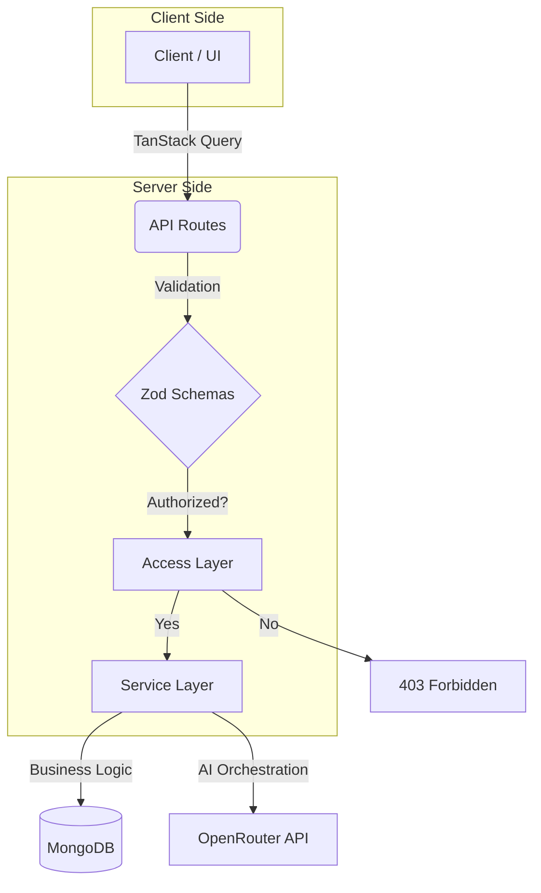

<div align="center">
  
  <h1>Multi-Tenant AI Assistant Platform</h1>
  
  <p>
    <strong>A scalable, multi-tenant SaaS application with config-driven admin dashboards and AI-powered product instances.</strong>
  </p>

  <p>
    <a href="#overview">Overview</a> •
    <a href="#key-features">Features</a> •
    <a href="#architecture">Architecture</a> •
    <a href="#installation">Installation</a> •
    <a href="#demo">Demo</a>
  </p>

  <br/>

  <!-- Tech Stack Badges -->
  <div align="center">
    
    
    
    
    
    
    
    
  </div>
</div>

<br/>

## 🚀 Overview

**Nexus AI** is a production-ready, multi-tenant SaaS platform designed to manage AI-powered product instances across multiple organizations (tenants). 

Unlike traditional monolithic applications, Nexus AI features a **config-driven architecture** where the admin dashboard UI is dynamically rendered based on MongoDB documents. This allows for instant UI updates without code redeployment, making it highly adaptable for different client needs.

### Core Concepts:
*   **Multi-Tenancy:** Strict isolation between projects (tenants) ensuring data security and privacy.
*   **AI-Powered Instances:** Each project can host multiple AI-driven products (e.g., Support Bots, CRM Assistants).
*   **Config-Driven UI:** The admin dashboard layout, widgets, and components are defined in the database, not hardcoded.
*   **Layered Architecture:** Clean separation of concerns from Access Control to UI Components.

---

## 🧠 Key Features

*   **🏢 Multi-Tenant Architecture:** Robust project-based isolation using slugs and role-based access control (RBAC).
*   **🛡️ Role-Based Access Control (RBAC):** Granular permissions for `admin` vs. `member` roles, enforced at both server and client levels.
*   **🤖 AI-Powered Chat System:** Integrated with **OpenRouter API**, featuring context-aware responses and step-based processing logic.
*   **⚙️ Config-Driven Dashboard:** Admin UI is fully dynamic. Change widget layouts, stats cards, and integration statuses via MongoDB docs.
*   **🔌 Integration Simulation:** Toggleable integrations for Shopify and CRM systems to demonstrate extensibility.
*   **⚡ Real-Time UX:** Optimistic UI updates, loading states, error handling, and empty states powered by **TanStack Query**.
*   **✅ Type-Safe Validation:** End-to-end type safety with **TypeScript** and runtime validation using **Zod**.

---

## 🏗️ Architecture

The project follows a clean, layered architecture pattern to ensure scalability and maintainability.



## Layer Breakdown:
```text
Access Layer (access/): Handles authorization logic, RBAC checks, and project scoping.
Service Layer (services/): Contains pure business logic, AI orchestration, and data aggregation. No HTTP specifics here.
API Routes (app/api/): Thin controllers that handle HTTP requests, validate inputs with Zod, and call services.
Hooks (hooks/): Client-side data fetching and state management using TanStack Query.
UI (components/): Reusable React components styled with Tailwind CSS.
```

## 🗄️ Database Design
```text
The application uses MongoDB with Mongoose for schema modeling.
Collection
Description
Projects
The tenant boundary. Contains slug, name, and settings.
Users
Users belong to projects via projectRoles. Stores auth info.
Product Instances
AI products linked to a specific project (e.g., "Support Bot").
Conversations
Threaded conversations within a product instance.
Messages
Individual messages within a conversation (user/AI).
Admin Dashboard Config
Key Feature: JSON document defining the UI layout, widgets, and visibility for the admin dashboard.
💡 Insight: The AdminDashboardConfig collection allows admins to toggle widgets like stats_card, integration_status, or text_block instantly. Changing this document updates the UI immediately without a frontend deploy.
```

## 🤖 AI Integration
```text
Provider: Uses OpenRouter API (compatible with free-tier models).
Orchestration: AI calls are strictly controlled from the services/ai.service.ts layer.
Context Awareness: The AI receives context about enabled integrations (Shopify/CRM) to tailor its responses.
Step-Based Processing: Simulates complex workflows (e.g., "Analyzing data...", "Fetching order details...") before delivering the final answer.
```

## ⚙️ Config-Driven Admin Dashboard
```text
This is the standout feature of Nexus AI. Instead of hardcoding the admin dashboard:
Database-Defined UI: The structure of the dashboard is stored in MongoDB.
Dynamic Rendering: The WidgetRender.tsx component reads the config and renders appropriate widgets (StatsCard, IntegrationStatus, etc.).
Instant Updates: Modify the JSON config in the database → Refresh the page → See the new layout.
```

### Example Config Structure:
```bash
{
  "widgets": [
    { "type": "stats_card", "title": "Total Conversations", "metric": "conversationCount" },
    { "type": "integration_status", "service": "shopify" },
    { "type": "text_block", "content": "Welcome back, Admin!" }
  ]
}
```

## 📦 Installation & Setup
```text
Prerequisites
Node.js 18+
MongoDB Instance (Local or Atlas)
OpenRouter API Key
```

### Steps
#### 1. Clone the repository:
```bash
git clone (https://github.com/Bhawana0218/Multi-Tenant-AI.git)
cd nexus-ai
```
#### 2. Install dependencies:
```bash
npm install
```

#### 3. Set up environment variables:
```bash
MONGODB_URI=mongodb+srv://<username>:<password>@cluster.mongodb.net/nexus-ai
OPENROUTER_API_KEY=sk-or-v1-...
NEXTAUTH_SECRET=your-secret-key
```

#### 4. Run the development server:
```bash
npm run dev
```

#### 5.Seed the database (Recommended):
```bash
npx tsx scripts/seed.ts
```
## 🔐 Authentication & Authorization
```text
Simulated Login: For demo purposes, login is simulated via a dropdown selector. In production, this would be replaced by NextAuth.js or Clerk.
Server-Side Checks: Every API route validates the user's session and their role within the requested project slug.
Admin Protection: The /admin routes are strictly protected; only users with role: 'admin' can access dashboard configurations.
```

## 📸 Demo Instructions
```text
To showcase the Config-Driven Dashboard:
Log in as an Admin user.
Navigate to the Admin Dashboard.
Open your MongoDB Compass or Atlas interface.
Find the admindashboardconfigs collection.
Edit the document: Remove a widget, add a new text_block, or change the order.
Save the document.
Refresh the browser. You will see the dashboard layout update instantly without any code changes!
```

## 📁 Folder Structure
```bash
nexus-ai/
├── access/                 # Authorization & RBAC logic
│   ├── projectAccess.ts
│   └── rbac.ts
├── app/                    # Next.js App Router
│   ├── (dashboard)/        # Protected routes
│   │   ├── [projectSlug]/
│   │   │   ├── admin/      # Config-driven admin dashboard
│   │   │   └── chat/       # AI Chat interface
│   │   └── api/            # API Routes
│   ├── globals.css
│   └── layout.tsx
├── components/             # React Components
│   ├── admin/              # Admin-specific widgets
│   │   ├── WidgetRender.tsx
│   │   └── StatsCard.tsx
│   └── chat/               # Chat UI components
│       ├── MessageBubble.tsx
│       └── Sidebar.tsx
├── hooks/                  # TanStack Query Hooks
│   ├── useAdminDashboard.ts
│   └── useChat.ts
├── lib/                    # Utilities
│   ├── ai.ts               # OpenRouter client
│   ├── auth.ts             # Auth helpers
│   └── mongoose.ts         # DB connection
├── models/                 # Mongoose Schemas
│   ├── admin/
│   ├── chat/
│   ├── product/
│   ├── project/
│   └── user/
├── services/               # Business Logic Layer
│   ├── admin.service.ts
│   ├── ai.service.ts
│   └── chat.service.ts
├── zod/                    # Validation Schemas
│   ├── chat.ts
│   └── project.ts
├── scripts/
│   └── seed.ts             # Database seeding script
└── public/                 # Static assets
```

## 🧪 Bonus Features
```text
Modular Widget System: Easily create new widget types by adding a case in WidgetRender.tsx.
Optimistic UI: Chat messages appear instantly before server confirmation.
Clean Error Handling: Graceful fallbacks for API failures and empty states.
Scalable Codebase: Designed to support hundreds of tenants and thousands of conversations.
```

## 🧑‍💻 Author
```text
Bhawana Bisht
https://github.com/Bhawana0218 | www.linkedin.com/in/bhawana-bisht-5442582b3
```

<div align="center">
<sub>Built with ❤️ using Next.js, MongoDB, and OpenRouter</sub>
</div>
